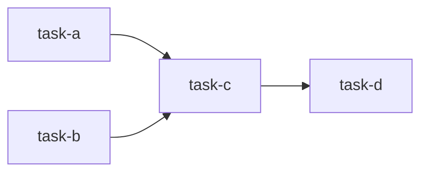

# Write implementation specifications

Create structured implementation specs that can be directly consumed by the `parallel-implement-spec` skill for parallel, worktree-based execution.

## Usage

Use this skill when asked to write an implementation spec, break down a feature into tasks, or plan a multi-file change. The user provides the goal (a feature description, issue, design doc, or verbal request). The agent explores the codebase, designs the task breakdown, and writes a spec document.

## Exploration phase

Before writing the spec, thoroughly explore the codebase:

1. **Understand the goal** — clarify scope with the user if ambiguous.
2. **Map existing code** — identify relevant modules, patterns, conventions, and extension points using explore agents.
3. **Identify touch-points** — list every file that will be created or modified.
4. **Note conventions** — build/test commands, module registration patterns (mod.rs, barrel exports, index files), naming conventions, error handling style.

## Spec document structure

Write the spec as a Markdown file (default path: `docs/specs/<feature-name>.md` or as the user directs). Use exactly this structure:

### Front matter

```markdown
# <Feature title>

**Goal:** One-sentence summary of what this spec delivers.

**Build/test commands:**
- Build: `<command>`
- Test: `<command>`
- Lint: `<command>`
```

### Task list with dependency graph

Each task gets a level-2 heading with a kebab-case ID. Tasks must declare their dependencies explicitly, list every file they touch, and contain enough detail that a subagent can implement the task without asking follow-up questions.

```markdown
## Task: <task-id>

**Summary:** One-sentence description of what this task does.

**Depends on:** `<task-id>`, `<task-id>` (or "none")

**Files:**
- `path/to/new_file.rs` (create)
- `path/to/existing_file.rs` (modify)

**Details:**

< Implementation details: what to add, where to hook in,
  data structures, function signatures, error handling,
  edge cases, and any non-obvious design choices.
  Reference existing code patterns by file path. >

**Acceptance criteria:**
- [ ] <concrete, verifiable outcome>
- [ ] <concrete, verifiable outcome>
```

### Dependency graph summary

After all tasks, include a Mermaid dependency graph for quick visual reference:

````markdown
## Dependency graph


````

## Task design rules

These rules ensure the spec is compatible with parallel worktree execution:

1. **Atomic tasks** — each task produces a single, self-contained commit. A task should not depend on uncommitted work from another task running in a parallel worktree.

2. **Minimal file overlap** — tasks that can run in parallel (same wave) should touch disjoint sets of files. Shared registration files (mod.rs, index.ts, Cargo.toml, etc.) are the expected exception; the implementor handles merge conflicts on those.

3. **Explicit dependencies** — if task B reads types/functions introduced by task A, B must declare `Depends on: task-a`. Never leave dependencies implicit.

4. **No circular dependencies** — the dependency graph must be a DAG. If a cycle is unavoidable, restructure the tasks (e.g., extract a shared-types task that both depend on).

5. **Leaf-heavy graphs** — prefer many independent leaf tasks (wave 0) over deep dependency chains. This maximizes parallelism.

6. **Self-contained detail** — each task's Details section must be complete enough for an agent with no prior context (beyond the spec and codebase) to implement it. Include function signatures, struct fields, error variants, and concrete file paths.

7. **Integration task last** — if final wiring is needed (e.g., connecting all new modules in a top-level orchestrator), make it the last task depending on all others.

## Output quality rules

- Reference existing code by file path and function/type name — never say "the existing handler" without a path.
- Include build and test commands so the implementor can verify each task.
- If the feature adds new dependencies (crates, packages), specify the exact dependency and version in the task that introduces it.
- Keep acceptance criteria concrete and verifiable (compiles, test passes, behavior observable) — not subjective ("clean code").
- If uncertainty remains about a design choice, call it out in a **Open questions** section at the end and ask the user before finalizing.

## Delivery

1. Write the spec to the agreed path.
2. Present a summary to the user: task count, dependency depth (number of waves), and any open questions.
3. Do NOT begin implementation — the user will invoke `parallel-implement-spec` separately when ready.
